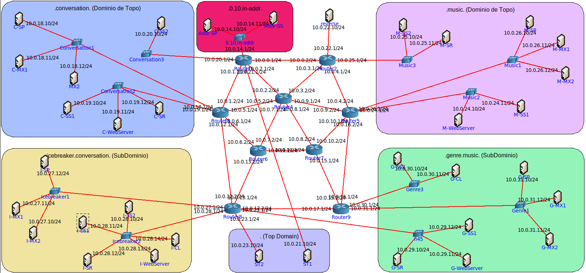

[under maintenance]
# Domain Name System - DNS
This project is a simple and fairly accurate implementation of a domain name system. This project was devloped in python and tested using core network emulator.

## System components

## Iterative mode

## Recursive mode

## Topology (for testing)

